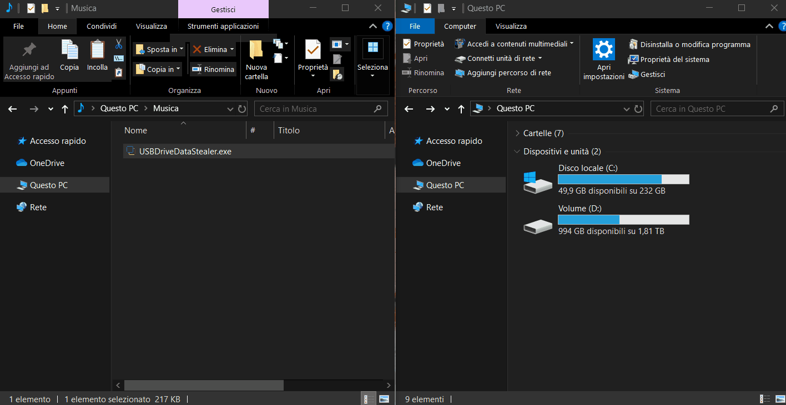

<h1 align="center">USB Drive Data Stealer</h1>

<h2>Disclaimer &#9888;&#65039;</h2>
USB Drive Data Stealer is developed for educational purposes only. 
Responsibility for consequences of using this application remains with the user; <b>I'm not responsible for how you use it</b>. 

<h2>What is it for? &#129300;</h2>
It's a simple tool that steals a drive's data when it is plugged into your pc. 
It's currently programmed to steal <b>removable drive</b> (USB flash drives, external hard disks, ...) or <b>CD\DVD</b> data only, but can be easily modified to steal data from <a href="https://learn.microsoft.com/en-us/dotnet/api/system.io.drivetype?view=net-8.0#fields" target="_blank" rel="noopener noreferrer">these</a> drives as well, by simply modifying the if clause <code>if (newDrive.DriveType == DriveType.Removable || ...)</code> of the <code>TMRwaitForDrive_Tick(...)</code> function.

<h2>What do I need to execute USB Drive Data Stealer? &#9654;</h2>
You'll need two things:
<ol>
  <li>
    The .NET Framework 
    I wrote USB Drive Data Stealer in C# for .NET Frameowrk 4.5 using Visual Studio 2019 so, in order to run it, you must have that version of the framework (or a later one) installed. 
    If it isn't already installed on your OS, you can download it <a href="https://www.microsoft.com/en-us/download/details.aspx?id=30653" target="_blank" rel="noopener noreferrer">here</a>.
  </li>

  <li>
    USBDriveDataStealer.exe 
    You can download it directly from <a href="https://github.com/LucaBarile/USBDriveDataStealer/raw/main/USBDriveDataStealer.exe" target="_blank" rel="noopener noreferrer">here</a>. 
    If you want to compile it or modify its source code, you can download the zipped project <a href="https://github.com/LucaBarile/USBDriveDataStealer/raw/main/USBDriveDataStealer.zip" target="_blank" rel="noopener noreferrer">here</a> and recompile it.
  </li>
</ol>

<h2>Three different modes of operation &#49;&#65039;&#8419; &#50;&#65039;&#8419; &#51;&#65039;&#8419;</h2>
When someone plugs a USB drive into our PC, we don't know how long they will leave it plugged in. 
Suppose, for example, someone asks you to copy some files to their USB drive. Probably the copying of the files will not last very long.... Will USB Drive Data Stealer be able to steal all the contents of the USB drive in time? 
 
To solve this possible problem I implemented three different modes of operation:
<ol>
  <li>
    <b>Steal all device files</b> 
    The entire contents of the drive will be copied to your PC. 
    If it contains large files and the data transfer rate is low, the probability of not being able to copy all the data before the drive is unplugged increases.
  </li>
  
  <li>
    <b>Steal all files smaller or equal than a specified size</b> 
    Only files smaller or equal than the size you specified (in megabytes) via the GUI will be copied to your PC. 
    This solves the problem explained in the previous point discarding the larger files and, consequently, decreasing the time needed to copy the others.
  </li>
  
  <li>
    <b>Steal only files with specific extensions</b> 
    Only files with an extension among those you have listed via the GUI will be copied to your PC. 
    If you are interested in copying only some particular types of files (e.g. PDF, images, audio, ...), this mode of operation is for you. 
    Since all types of files with extensions other than those allowed will not be copied, even in this case, the time required for copying will be shorter.
  </li>
</ol>

<h2>How it works? &#9881;&#65039;</h2>
After selecting the mode of operation, the folder to save the stolen files and pressing the <code>BTNwait</code> ("Wait for USB Drive connection") button, USB Drive Data Stealer will be minimized to the Windows traybar, store the list of all drives currently connected to the PC (let's call it L1) and wait for a drive to be plugged into the PC. 
Detecting the connection of a new drive to the PC is done by the <code>TMRwaitForDrive</code> timer. It compares, every five seconds, the list of drives currently connected to the PC (let's call it L2) with L1. If L2 contains more drives than those listed in L1, the last drive listed in L2 is considered the target drive to steal files from, according to the user-specified mode of operation. 
At this point, the subfolder <code>YYYY-MM-DD_hh.mm.ss</code> (e.g., 2024-06-24_15.31.22) is created in the folder specified by the user via the GUI, the copying process begins, and the files from the target drive are copied to the newly created subfolder. 
Copying of files and folders is done recursively, maintaining the hierarchical file system structure. There're three functions used to copy files (<code>copyAllFiles</code>, <code>copySmallFiles</code> and <code>copySpecificFiles</code>), but only the one related to the mode of operation specified by the user via the GUI will be executed. 
If an error occurs during the copy process (e.g., the target drive is removed), its description will be stored in the <code>_CrashReport.txt</code> log file, which will be saved in the folder initially specified by the user. 
Whether the copy process ends successfully or abnormally, USB Drive Data Stealer will remove itself from the Windows traybar and self-terminate. 

<h2>Demo &#127910;</h2>
This demonstration shows the execution of USB Drive Data Stealer, set to run in the first mode of operation (&quot;Steal all device files&quot;). 
 

  

<h2>Notes, limitations and improvements &#128466;&#128721;&#128736;</h2>
<ol>
  <li>
    Instead of using a <a href="https://learn.microsoft.com/en-us/dotnet/api/system.timers.timer" target="_blank" rel="noopener noreferrer">Timer</a> to detect the arrival\removal of a new drive, you can use the <a href="https://learn.microsoft.com/en-us/dotnet/api/system.management.managementeventwatcher" target="_blank" rel="noopener noreferrer">ManagementEventWatcher</a> class associated with the <code>SELECT * FROM Win32_VolumeChangeEvent WHERE EventType = 2</code> <a href="https://learn.microsoft.com/it-it/dotnet/api/system.management.wqleventquery"target="_blank" rel="noopener noreferrer">WqlEventQuery</a> where, according to the <a href="https://learn.microsoft.com/en-us/windows/win32/cimwin32prov/win32-volumechangeevent#properties" target="_blank" rel="noopener noreferrer">properties</a> of the <a href="https://learn.microsoft.com/en-us/windows/win32/cimwin32prov/win32-volumechangeevent" target="_blank" rel="noopener noreferrer">Win32_VolumeChangeEvent</a> class, 2 = Device Arrival and 3 = Device Removal. 
  </li>

  <li>
    Considering the last L2 drive as the target drive from which to steal files is an idea that probably works in the vast majority of cases, but it may not always work. 
The drives listed in L2 are listed with letters that follow an ascending order. Usually the first drive is C (where the OS is installed), if the hard drive has two partitions the second drive will be D, and if a USB flash drive is plugged in, it will probably be named with the letter E. 
So far so good but... What would happen if the user inserted two floppy disks (hey! Who the hell still uses floppy disks?! &#128552;)? According to the <a href="https://en.wikipedia.org/wiki/Drive_letter_assignment#Common_assignments" target="_blank" rel="noopener noreferrer">common drive letter assignments</a>, the first floppy would be assigned the letter A and the second would be assigned the letter B. Then the algorithm would choose hard disk partition D (the last L2 drive) as the target drive from which to copy the data, failing miserably &#129318;&#128514;
  </li>

  <li>
    If multiple drives were plugged in, USB Drive Data Stealer would steal files only from the last one (because, as mentioned before, only the last drive listed in L2 is considered the target drive to steal files from).
  </li>

  <li>
    If USB Drive Data Stealer finishes copying the files of one drive and, later, another drive (or more than one) is plugged in, no more files will be copied because, as mentioned before, the application self-terminates at the end of the copying process. 
This means that the user must re-run the program before another drive is plugged in, if they want to copy its files as well.
  </li>

  <li>
    USB Drive Data Stealer isn't displayed in the Windows taskbar and in the list of active processes shown by the Windows Task Manager, in order to avoid possible suspicion by the user connecting the drive to the PC.
  </li>

  <li>
    The <code>YYYY-MM-DD_hh.mm.ss</code> format of the subdirectory described above, prevents the overwriting of data stolen from different drives on the same day.
  </li>
</ol>

As you can read, there are several changes and improvements that can be applied to USB Drive Data Stealer. For example:
<ul>
  <li>
    Solve the problem indicated in step 2 by checking what is actually the new connected drive that makes the L2 list different from L1.
  </li>

  <li>
    Solve the problem indicated in step 3 by managing simultaneous copies of files (e.g., using threads) from all drives connected to the PC.
  </li>

  <li>
    Solve the problem indicated in step 4 by putting USB Drive Data Stealer back to wait for a drive to be plugged into the PC.
  </li>

  <li>
    Implement keyboard shortcuts (such as, Ctrl+Alt+R, Ctrl+Alt+X, ...) to pause, start, restart, terminate or put in background\foreground USB Drive Data Stealer.
  </li>

  <li>
    Prevent safe removal of the drive if USB Drive Data Stealer hasn't finished copying the files to the PC yet.
  </li>
</ul>

I developed this project quickly, in my spare time; there're other things that could be done if there was time... 
Feel free to <a href="https://docs.github.com/en/pull-requests/collaborating-with-pull-requests/working-with-forks/fork-a-repo" target="_blank" rel="noopener noreferrer">fork</a>, edit, improve, and share this project without any problems &#128522;

<h2>Aims of the program &#127919;</h2>
<ul>
  <li>
    Make yourself aware that by plugging an USB drive into a device, you are always exposing its data to a potential risk. 
    This is true even if the device belongs to a person you know and trust; it may have been infected by a malware that, among other malicious actions, could do exactly what USB Drive Data Stealer does, sending the collected data to the attacker. 
    You could solve the problem by using a USB drive containing nonconfidential files whose theft and/or publication would not be a problem for you.
  </li>
  
  <li>
    Show, by means of an engaging program (imo), the basics of C# and event-driven programming, and the ease with which a Windows GUI application can be built using this language.
  </li>

  <li>
    Show, for teaching purposes, an example of simple malware.
  </li>
  
  <li>
    Talking about cybersecurity.
  </li>
</ul>

<h2>Download links &#128229;</h2>
<a href="https://github.com/LucaBarile/USBDriveDataStealer/raw/main/USBDriveDataStealer.exe" target="_blank" rel="noopener noreferrer">Here</a> you can download USBDriveDataStealer.exe 
<a href="https://github.com/LucaBarile/USBDriveDataStealer/raw/main/USBDriveDataStealer.zip" target="_blank" rel="noopener noreferrer">Here</a> you can download the Visual Studio 2019 zipped project. 

<h2>What more can I do? &#129300;</h2>
<a href="https://lucabarile.github.io/" target="_blank">Here</a> you can visit my website &#127760; 
<a href="https://www.buymeacoffee.com/LucaBarile" target="_blank">Here</a> you can buy me a unicorn &#129412; 
